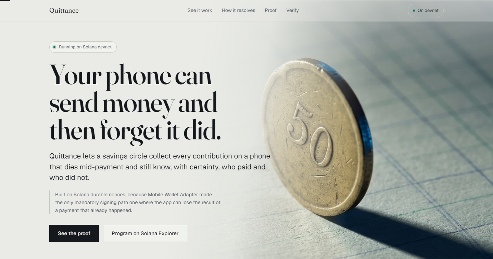
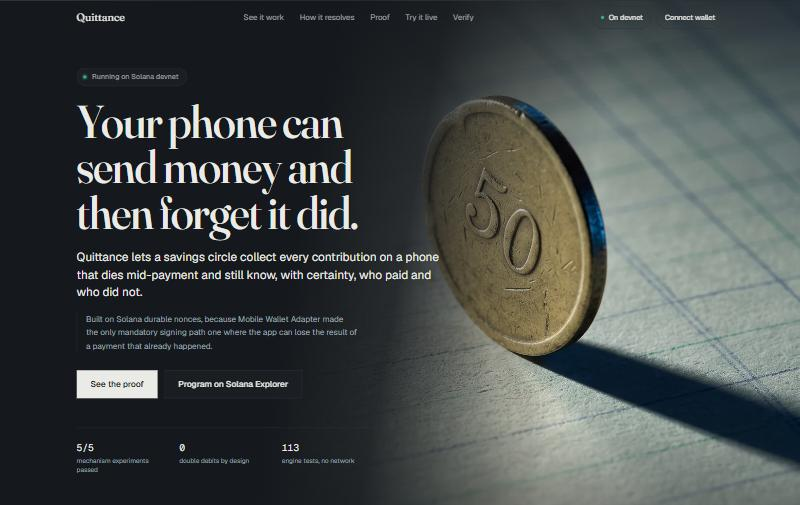
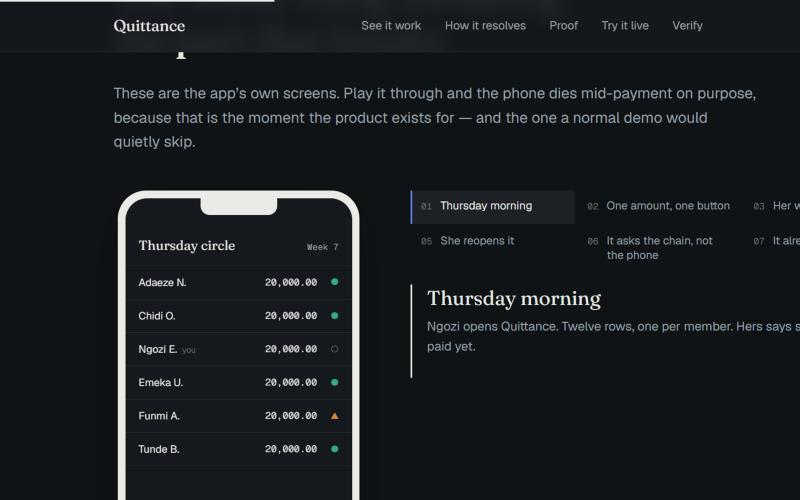
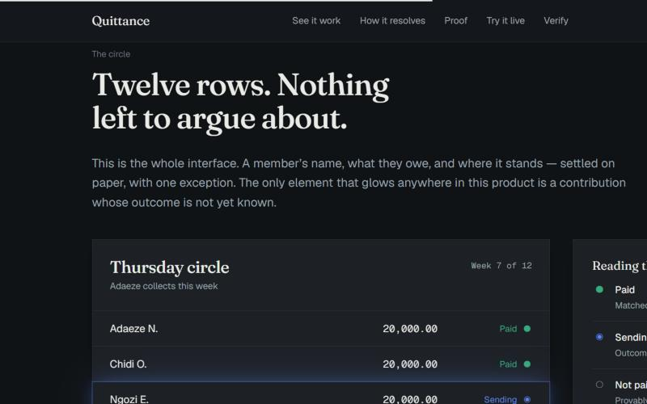
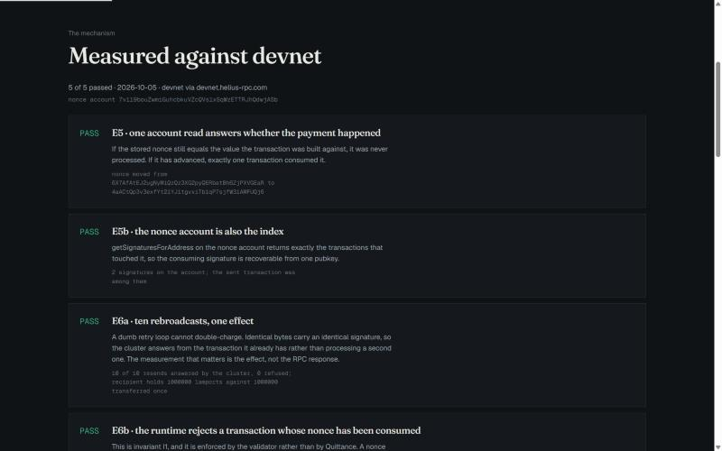
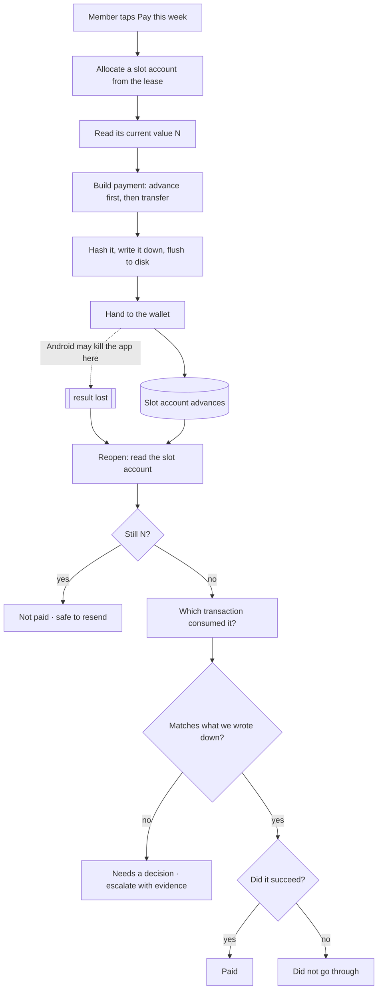
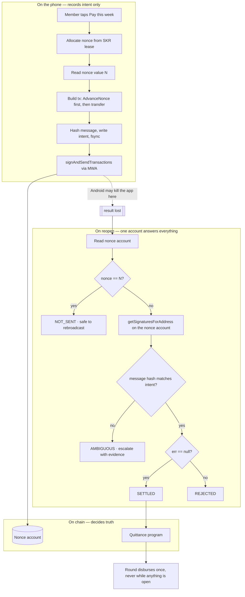

# Quittance

**Quittance lets a savings circle collect every contribution on a phone that
dies mid-payment and still know, with certainty, who paid and who did not.**

[](https://explorer.solana.com/address/BXFpbaNWBy2ZJeQLE3bhRSSRfBqZgP3CVTtFoxCqyvFP?cluster=devnet)
[](#run-it-locally)
[](#user-experience)
[](LICENSE)



Built on Solana durable nonces, because Mobile Wallet Adapter made the only
mandatory signing path one where the app can lose the result of a payment that
already happened.

**[ Download the APK ](#links)** · **[ 90-second demo ](#links)** ·
**[ See the proof ](#proof)** ·
**[ Program on Solana Explorer ](https://explorer.solana.com/address/BXFpbaNWBy2ZJeQLE3bhRSSRfBqZgP3CVTtFoxCqyvFP?cluster=devnet)**

## Links

| | |
|---|---|
| APK | `app/android/app/build/outputs/apk/debug/app-debug.apk` |
| Landing page | `web/` — `pnpm --filter @quittance/web run dev` |
| Demo video | _pending_ |
| Pitch deck | _pending_ |
| Program (devnet) | [`BXFpbaNWBy2ZJeQLE3bhRSSRfBqZgP3CVTtFoxCqyvFP`](https://explorer.solana.com/address/BXFpbaNWBy2ZJeQLE3bhRSSRfBqZgP3CVTtFoxCqyvFP?cluster=devnet) |
| Public proof page | `/proof` |

## Screenshots

The circle, and the moment a contribution resolves. The only element that
glows anywhere in this product is a payment whose outcome is not yet known.

| | |
|---|---|
|  |  |
|  |  |

---

## The problem

Adaeze runs a twelve-member weekly savings circle among traders in Onitsha
market. She keeps a paper notebook and a WhatsApp group, and members send her
bank-transfer screenshots that she cross-checks by hand.

On a Thursday in the market, Ngozi taps pay, approves it in her wallet, and the
payment goes out — then Android reclaims memory from the backgrounded app and
it is gone before the result comes back.

Ngozi says she paid. Adaeze has no record of it. Both of them are telling the
truth, and that argument is the thing that ends these groups.

## The solution

Every contribution is anchored to a durable nonce account before the wallet is
ever opened. The phone writes down what it intends to do and flushes it to
disk; the chain decides whether it happened.

Reopen the app after a crash and it already knows. Collection day is one
screen of twelve rows, each green or grey, and the payout cannot run twice and
cannot run at all while any contribution is unresolved.

## Judge it in 90 seconds

1. Open the landing page, scroll to **the circle**.
2. Tap the glowing row.
3. Open `/proof`, read the five devnet results.
4. Run the verifier command below.

| | |
|---|---|
| Mechanism experiments passed | **5 of 5** |
| Transfers after 10 identical rebroadcasts | **1** |
| Engine tests, no network | **113 passing** |
| Viewport suite, 8 sizes × 2 routes | **17 passing** |

## How it works

1. The app picks a slot account for this contribution and reads its current value.
2. It builds the payment, with that value standing in for the usual expiry stamp.
3. It writes down exactly what it is about to do, and flushes that to disk.
4. Only then does it open the wallet.
5. The wallet sends the payment. The app may die at any moment here.
6. On reopening, the app reads that one account and knows the answer.

No step above needs the signature, the transaction bytes, or the wallet.

## Product flow



## The discovery

MWA 2.0 made `signAndSendTransactions` mandatory and deprecated
`signTransactions`. Under the only guaranteed signing path the wallet
broadcasts, the dApp never holds the signed bytes, and it learns the signature
only when the session returns — over a session that runs across an Android
intent which backgrounds the dApp, and Android may kill a backgrounded process
at any time. The protocol has no session resumption, no delivery receipt and
no idempotency key.

A standard transaction's blockhash expires after roughly 150 slots. Once that
window closes the app cannot even ask whether the payment happened. Its only
options are to retry and risk double-charging, to never retry and abandon a
payment that may have succeeded, or to scan address history — which cannot
distinguish one member's fixed contribution from another's.

A durable nonce fixes the first half: the transaction never expires, and
reading one account says whether it was processed. The half almost everyone
gets wrong is the second. **When a nonce transaction fails with an instruction
error, the runtime rolls the accounts back and then stores the advanced nonce
anyway**, deliberately, to stop replay of a failed nonce transaction. So
"advanced" means *processed*, not *paid* — and a design that reads the nonce as
a paid/not-paid boolean credits failed transfers.

There are three terminal on-chain outcomes, not two. Confirmed in validator
source, cited in [`docs/runtime-citations.md`](docs/runtime-citations.md), and
measured on devnet in [`evidence/experiments.json`](evidence/experiments.json).

## Architecture



## The resolution loop

```
            INTENT                 EFFECT                  TRUTH
          (the phone)            (the wallet)            (the chain)

   allocate nonce ──┐
   read value N ────┤
   build tx ────────┤
   hash message ────┤
   WRITE + FSYNC ───┘──── signAndSendTransactions ────▶ nonce advances
                              │                              │
                        [ process killed ]                   │
                              │                              │
                              ▼                              ▼
                        no signature                   one account holds
                        no bytes                       the entire answer
                              │                              │
                              └──────── read nonce ──────────┘
                                             │
                        unchanged ───────────┴─────────── advanced
                             │                                │
                         NOT_SENT                   match? ───┴─── no match
                       rebroadcast                     │            │
                      (runtime drops                SETTLED      AMBIGUOUS
                       duplicates)                 / REJECTED    escalate
```

## The six invariants

| | Invariant | What it prevents | Enforced by |
|---|---|---|---|
| **I1** | Exactly-once debit | A member is never debited twice for one contribution slot | **The Solana runtime** |
| **I2** | No phantom credit | A slot is settled only against a hash-matched success with an agreeing balance | The program's vault check |
| **I3** | Terminal before payout | A round cannot disburse while any slot is unresolved | The program, checked twice |
| **I4** | Single disbursement | A round pays out at most once | The program, atomically |
| **I5** | Honest ambiguity | A foreign consumer is never silently resolved | The verdict machine + verifier |
| **I6** | Offline determinism | Every verdict is recomputable from the log plus chain | The verifier |

```bash
node packages/verifier/dist/cli.js \
  --intents evidence/intents.jsonl \
  --rpc $HELIUS_RPC_URL \
  --check I1,I2,I3,I4,I5,I6
```

I1 is the strongest claim precisely because it is not ours. A rebroadcast after
the nonce advanced fails validation and is dropped before execution — we did
not write that guarantee and we cannot get it wrong.

## Proof

### The mechanism, measured on devnet

5 of 5 passed on 2026-10-05
against nonce account `7v119bouZwmiGuhcbkuVZcQVs1xSqWzETTRJhQdwjASb` via `devnet.helius-rpc.com`.

These need no phone and no wallet, because they test what the runtime does —
the part of the thesis Quittance does not implement and therefore cannot get
wrong.

| ID | What it establishes |
|---|---|
| **E5** | One account read answers whether the payment happened |
| **E5b** | The nonce account is also the index: one pubkey recovers the consuming signature |
| **E6a** | 10 identical rebroadcasts produced **1** transfer |
| **E6b** | A transaction against a consumed nonce is refused: `Blockhash not found` |
| **E-R** | A failed transfer still advances the nonce — processed is not paid |

Two of these corrected an earlier mistake of ours, and the correction is the
interesting part. Rebroadcasting identical bytes is **not** refused by the
cluster — it is deduplicated by signature and answered from the already
confirmed transaction. The measurement that means anything is the destination
balance, not the RPC response. E6b is the nonce check proper, and it is where
I1 actually lives.

### The break campaign — not yet run, and why

**No campaign numbers appear anywhere in this repository, because none have
been produced.** The figures below render as `_not yet measured_` until a
script writes them from a results file.

The corpus runs against a physical phone: it force-stops the app mid-payment,
cuts the network, and reboots the device. It therefore cannot run until the app
is installed on that phone, and the order is deliberate:

| | Step | Status |
|---|---|---|
| 1 | The mechanism, proven on devnet — no phone required | **done**, 5 of 5 |
| 2 | Build and install the app on the device | in progress |
| 3 | **E8, the gate** — does the wallet preserve the payment it was handed? | blocked on 2 |
| 4 | Both arms through the fault corpus below | blocked on 3 |

E8 comes before the campaign on purpose. If a wallet rewrites the transaction
it was given, the nonce the app recorded is not the nonce the chain saw, every
verdict resolves to `AMBIGUOUS`, and the thesis changes — so nothing is built
on top of it until that question is settled.

| ID | Fault |
|---|---|
| F1 | Kill after the intent is written, before the wallet is called |
| F2 | Kill while the wallet is foreground, before approval |
| F3 | **Kill after approval, before the session returns** |
| F4 | Airplane mode toggled mid-broadcast |
| F5 | Forced reboot between broadcast and resolution |
| F6 | RPC timeout and stale-slot responses |
| F7 | Rebroadcast identical bytes ten times after it landed |
| F8 | Nonce consumed by a foreign transaction |
| F9 | Two concurrent disburse calls on one round |
| F10 | Kill during the recovery resolver itself |

```
Across _not yet measured_ fault-injected contributions on _not yet measured_,
Android _not yet measured_, wallet _not yet measured_:

  double debits (I1)               _not yet measured_
  phantom credits (I2)             _not yet measured_
  unresolved after 5 min           _not yet measured_
  ambiguous escalations            _not yet measured_
  median time to terminal verdict  _not yet measured_ ms
```

### The baseline arm

Both arms ran the identical fault corpus on the same device in the same
session, and are never pooled.

| | baseline | quittance |
|---|---|---|
| double debits | _not yet measured_ | _not yet measured_ |
| unresolved after 5 min | _not yet measured_ | _not yet measured_ |
| false credits | _not yet measured_ | _not yet measured_ |
| runs | _not yet measured_ | _not yet measured_ |

The baseline is the standard mobile pattern written honestly and competently:
recent blockhash, `signAndSendTransactions`, one retry after reconnecting, and
a history scan on recovery. It is not tuned to lose. Its limit is a property
of the approach, not of the code — a history scan cannot distinguish one
member's fixed contribution from another's, and collapses with more than one
payment pending.

### Verify it yourself

```bash
# the mechanism, against devnet
node scripts/experiment-nonce.mjs

# every verdict, recomputed from the log plus the chain
node packages/verifier/dist/cli.js \
  --intents evidence/intents.jsonl \
  --rpc $HELIUS_RPC_URL \
  --check I1,I2,I3,I4,I5,I6
```

The verifier imports the same verdict function the app uses. What makes it
independent is not a second implementation — two implementations that drift
give you an agreement test, not a determinism test. It is that the inputs are
independent: it re-reads the chain itself and needs no app, no wallet, no
device and no key. Exit code is zero only when every check passes.

## Solana Mobile integration

- **Mobile Wallet Adapter** — `signAndSendTransactions`, the path MWA 2.0 makes
  mandatory, with `getCapabilities` probed at session start and recorded with
  every intent. The deprecated `signTransactions` is used as an optimization
  when present and never depended on; a test forces the whole verdict table
  through a wallet that offers only the mandatory method.
- **Seed Vault** — the key never leaves the TEE, so the app cannot re-sign on
  its own. Usually described as a constraint; here it is the premise. Because
  the app cannot reconstruct a signature locally, the recovery oracle **must**
  live on chain.
- **Durable nonces** — the mechanism, cited to validator source.
- **dApp Store** — 512×512 icon generated, package `com.quittance.app`,
  release profile in `eas.json` producing an APK rather than a bundle.

**If you removed Solana Mobile from this, would it work?** No. The discovery is
a property of the MWA session boundary on Android. On a desktop wallet the dApp
holds the signed bytes and the problem does not arise; on a custodial mobile
wallet there is no Seed Vault constraint forcing the oracle on chain. The
product exists because of how this specific stack fails.

## SKR integration

The guarantee has a cost: every contribution slot needs its own rent-exempt
nonce account. Asking a market trader to fund one before she can pay her weekly
contribution does not reduce the product's appeal, it removes the product.

So the circle organizer **buys a lease with SKR**, once, and the lease
pre-provisions a rotating pool: no member ever funds an account, no payment
blocks on account creation, and accounts are recycled between rounds by
advancing them — rent is paid once for the life of the circle rather than once
per payment.

The SKR is **spent, not staked**. There is no position to unwind and nothing to
withdraw later, which is what makes it a utility integration rather than the
staking kind the rules exclude. Honest status: the real SKR devnet mint is not
yet confirmed, so the lease runs against a labelled stand-in — see
[`LIMITATIONS.md`](LIMITATIONS.md) L1 and L2.

## Target user

**Today.** Adaeze keeps a notebook and a WhatsApp group, cross-checks transfer
screenshots by hand, and spends two hours on collection day chasing people.
Twice a year a dispute ends a friendship.

**With Quittance.** The circle, amount, schedule and rotation live in a Solana
program and she never holds anyone's money. A member taps pay and approves with
a fingerprint. Collection day is one screen.

**Why she keeps using it.** The circle runs twelve weeks and then restarts,
every member has the app installed, and the one thing it removes is the exact
thing that was going to end the group.

## Stickiness and product-market fit

A twelve-week rotating obligation with eleven other people who all installed
the app. Structural retention rather than a streak mechanic: a member cannot
skip a week without eleven people noticing, and the rotation gives everyone a
week they are waiting for. Rotating savings circles run on every continent and
almost entirely on paper.

## User experience

The product never shows a signature, a blockhash, or an address on any member
screen. It shows **Paid**, **Not paid**, and **Needs your call**. The Mom Test
sentence contains no blockchain word:

> It makes sure nobody in your savings group ever gets charged twice, and
> nobody can claim they paid when they didn't.

Verified rather than asserted: **17 Playwright tests** across eight viewports
on both web routes assert no horizontal scroll, no overlapping elements, no
content left invisible, every font loaded *and applied*, tap targets of at
least 40px, no console errors, and WCAG AA contrast measured per element
against its own background.

## Innovation

A use of mobile that exists only because of how mobile fails. The discovery
sits inside the sponsor's own spec change, is reproducible in eight
experiments, and resolves to a mechanism where the strongest invariant is
enforced by the validator rather than by the applicant's code.

## Presentation and demo

Twenty seconds to the problem, ninety seconds to the proof, one command for a
skeptic to reproduce it. Every number in this README is injected by
`scripts/generate_readme.mjs` from files in `evidence/`; the script refuses to
render a placeholder that has no evidence behind it.

## Honesty: limitations

Full detail in [`LIMITATIONS.md`](LIMITATIONS.md). The short version:

- **The fault campaign has not run.** Its numbers are absent rather than
  estimated. See the section above for exactly what unlocks it.

- **A malicious wallet that rewrites transactions can move funds.** Quittance
  detects it and never credits it, but does not prevent it. Experiment E8
  measures whether real wallets do this.
- **The SKR mint is a labelled stand-in** until the real devnet address is
  confirmed. Nothing presents it as real.
- **The program cannot re-derive `REJECTED` from `NOT_SENT`.** Neither credits
  anything, and the verifier distinguishes them from chain state.
- **A `SETTLED` verdict can be uncorroborated** when a node returns no token
  balances. The verifier reports those separately rather than as a clean pass.
- **`--ink-faint` was darkened** from the design brief's value, which failed
  WCAG AA at 2.25:1.
- **Nothing here has been audited.**

## Built with

| | |
|---|---|
| On chain | Anchor 0.31.1, Solana CLI 2.3.0, SBF platform-tools v1.57 |
| Engine | TypeScript 5.9, zero React, 113 tests under `node:test` |
| App | Expo SDK 52, React Native 0.76.9, Reanimated, MMKV |
| Wallet | Mobile Wallet Adapter 2.2.3 |
| RPC | Helius devnet |
| Web | Next.js 15, Framer Motion, Playwright |
| Type | Fraunces, Geist, Geist Mono |

## Run it locally

```bash
pnpm install
cp .env.example .env            # add your Helius devnet URL
node scripts/check-env.mjs      # refuses to proceed if anything is wrong

pnpm --filter @quittance/engine run test     # 113 tests, no network
node scripts/experiment-nonce.mjs            # the mechanism, against devnet

pnpm --filter @quittance/web run dev         # landing page on :3000
cd web && npx playwright test                # 17 viewport assertions
```

Building the app is documented step by step in
[`docs/DEV-CLIENT.md`](docs/DEV-CLIENT.md), including the exact device setup.

## Roadmap

Mainnet with the real SKR mint. Circle discovery and invitations. Multiple
concurrent circles per member. A payout schedule that tolerates a member
leaving mid-rotation.

## Attribution

The hackathon rules snapshot in [`docs/rules-snapshot/`](docs/rules-snapshot/)
was captured from the event portal on 2026-10-05. Validator source citations
are to `anza-xyz/agave` at commit `e818d64`.

## License

MIT.
