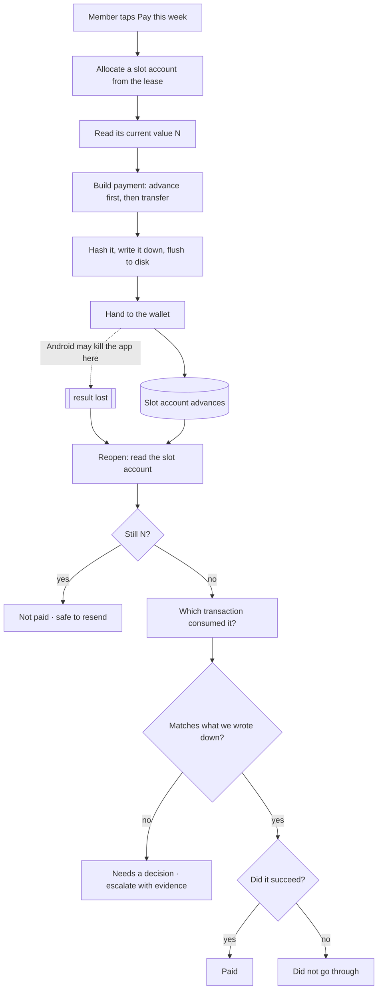
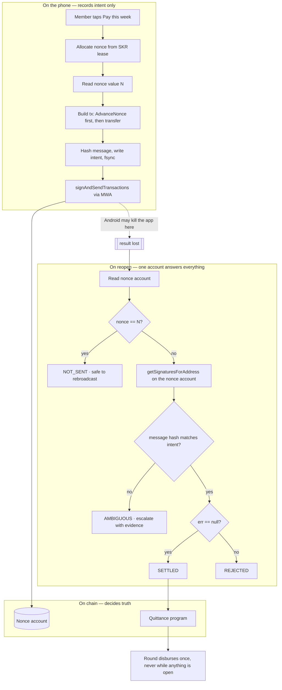

# Quittance

**A savings circle that still knows who paid after the phone dies mid-payment.**

[](https://quittance-inky.vercel.app)
[](https://explorer.solana.com/address/{{PROGRAM_ID}}?cluster=devnet)
[](#proof)
[](#run-it-locally)
[](#user-experience)
[](LICENSE)


Rotating savings circles — *ajo*, *esusu*, *chama*, *tanda*, *tontine* — run on
every continent and almost entirely on paper. Quittance moves one into a Solana
program on a phone, and solves the one problem that makes that unsafe today:

> Mobile Wallet Adapter 2.0 made `signAndSendTransactions` the only mandatory
> signing path. The wallet broadcasts, the app never holds the signed bytes,
> and Android may kill the app before the result comes back. The payment
> happened. The app never found out.

Quittance is built on **Solana durable nonces** so that one on-chain account
answers, forever and offline, whether a given payment happened.

**[Live site](https://quittance-inky.vercel.app)** ·
**[Proof page](https://quittance-inky.vercel.app/proof)** ·
**[Program on Explorer](https://explorer.solana.com/address/{{PROGRAM_ID}}?cluster=devnet)** ·
**[Source](https://github.com/0xkinno/quittance)**

---

## At a glance

| | |
|---|---|
| **What it is** | An Android savings-circle app whose payment state is recoverable from chain alone |
| **Who it is for** | Anyone running a rotating savings group — the Seeker community's home turf: mobile-first, wallet-native, cash-flow-sensitive |
| **The discovery** | Under MWA 2.0's mandatory path, a durable nonce account is the *only* crash-proof payment oracle — and "advanced" means *processed*, not *paid* |
| **What is original** | Three terminal on-chain outcomes (not two), a write-ahead intent store, a verdict machine with five honest ambiguity reasons, and six invariants checked twice |
| **Strongest guarantee** | Exactly-once debit is enforced by the **Solana runtime**, not by our code |
| **Stack** | Anchor program · TypeScript engine (zero React) · Expo / React Native app · Next.js proof site |
| **Network** | Solana devnet — program `{{PROGRAM_ID}}` |

## Links

| | |
|---|---|
| Live site | [quittance-inky.vercel.app](https://quittance-inky.vercel.app) — landing page, interactive judge demo, in-browser live check |
| Public proof page | [/proof](https://quittance-inky.vercel.app/proof) — every experiment result, read from generated files |
| Android APK | Release build, installable, runs standalone with no dev server — `app/android/app/build/outputs/apk/release/app-release.apk`, built by `./gradlew assembleRelease` ([steps](docs/DEV-CLIENT.md)); SHA-256 in [`EVIDENCE.md`](EVIDENCE.md) |
| Program ({{CLUSTER}}) | [`{{PROGRAM_ID}}`](https://explorer.solana.com/address/{{PROGRAM_ID}}?cluster=devnet) |
| Demo video | Three minutes, attached to the portal submission — script in [`docs/DEMO-SCRIPT.md`](docs/DEMO-SCRIPT.md) |
| Pitch deck | Attached to the portal submission |
| Repository | [github.com/0xkinno/quittance](https://github.com/0xkinno/quittance) |

## Screenshots

The circle, and the moment a contribution resolves. The only element that
glows anywhere in this product is a payment whose outcome is not yet known.

| | |
|---|---|
|  |  |
|  |  |

---

## CLOCK IN scorecard

The brief scores four equal 25% criteria and describes how it evaluates. This
is where each one lands, with the evidence next to the claim.

| Criterion (25% each) | What Quittance does | Where to see it |
|---|---|---|
| **Stickiness & PMF** | A twelve-week rotating obligation among people who all installed the app. Retention is structural, not a streak gimmick: a member cannot skip a week without eleven people noticing, and the rotation gives everyone a week they are waiting for. | [Target user](#target-user) · [Stickiness](#stickiness-and-product-market-fit) |
| **User experience** | Seven screens. No signature, blockhash or address on any member screen — only **Paid**, **Not paid**, **Needs your call**. One button on the home screen. Shape *and* colour carry state. Measured, not asserted: 17 Playwright tests, WCAG AA contrast per element. | [User experience](#user-experience) |
| **Innovation / X-factor** | A use of mobile that exists only because of how mobile fails. The discovery sits inside the sponsor's own spec change, and the central invariant is enforced by the validator. | [The discovery](#the-discovery) · [Innovation](#innovation) |
| **Presentation & demo** | An interactive eight-step judge demo that plays through the crash on purpose, a public proof page, a 90-second judging path, and one command for a skeptic to reproduce everything. | [Judge it in 90 seconds](#judge-it-in-90-seconds) |

| How the brief says it evaluates | Evidence |
|---|---|
| Completion | Release APK installed and running standalone on a physical Android device; live site; deployed program |
| Technical depth | Anchor program (7 instructions, 4 accounts, 24 error codes), 113-test engine, offline verifier, fault-injection harness, six invariants — see commit history |
| Mobile-optimized UX & mobile features | MWA `signAndSendTransactions`, Seed Vault as the design premise, MMKV write-ahead store with fsync, Android intent-lifecycle recovery, reduced-motion support |
| Usage of the Solana network | Deployed program, durable nonce accounts, five devnet experiments, and an in-browser check that runs the same mechanism against devnet with *your* wallet |
| Clarity & vision | [Problem](#the-problem) → [solution](#the-solution) → [proof](#proof) → [roadmap](#roadmap) |

---

## The problem

Adaeze runs a twelve-member weekly savings circle among traders in Onitsha
market. She keeps a paper notebook and a WhatsApp group, and members send her
bank-transfer screenshots that she cross-checks by hand.

On a Thursday in the market, Ngozi taps pay, approves it in her wallet, and the
payment goes out — then Android reclaims memory from the backgrounded app and
it is gone before the result comes back.

Ngozi says she paid. Adaeze has no record of it. Both of them are telling the
truth, and that argument is the thing that ends these groups.

## The solution

Every contribution is anchored to a durable nonce account before the wallet is
ever opened. The phone writes down what it intends to do and flushes it to
disk; the chain decides whether it happened.

Reopen the app after a crash and it already knows. Collection day is one
screen of twelve rows, each green or grey, and the payout cannot run twice and
cannot run at all while any contribution is unresolved.

## Judge it in 90 seconds

1. Open the [live site](https://quittance-inky.vercel.app) and press **Play the walkthrough** — the phone dies mid-payment on purpose.
2. Scroll to **the circle** and tap the glowing row to watch the chain answer.
3. Open [`/proof`](https://quittance-inky.vercel.app/proof) and read the five devnet results.
4. Scroll to **Prove it yourself**, connect a devnet wallet, and run the same mechanism live against the cluster — a durable-nonce payment built, hashed and read back in your own browser.
5. Run the verifier command below to recompute every verdict from chain state, with no app and no key.

| | |
|---|---|
| Mechanism experiments passed | **{{EXPERIMENTS_PASSED}} of {{EXPERIMENTS_TOTAL}}** |
| Transfers after {{E6A_RESENDS}} identical rebroadcasts | **{{E6A_EFFECTS}}** |
| Engine tests, no network | **113 passing** |
| Viewport suite, 8 sizes × 2 routes + contrast | **17 passing** |

## What has been verified, and how

Each claim sits at the tier it earned, and nothing is stated at a higher one.

| Tier | Claim | How it is established | Status |
|---|---|---|---|
| **Chain behaviour** | A consumed nonce rejects replays; a failed transfer still advances the nonce; ten identical rebroadcasts move funds once | Five experiments against devnet, raw output in [`evidence/experiments.json`](evidence/experiments.json), reproducible with one command | **Done — {{EXPERIMENTS_PASSED}} of {{EXPERIMENTS_TOTAL}}** |
| **Our logic** | The verdict machine, all six invariants, crash at every write-ahead boundary | 113 offline tests, each invariant tested clean *and* against a deliberately corrupted store | **Done — 113 passing** |
| **Our program** | I3 and I4 are enforced on chain; I2 is enforced by a vault check the client cannot talk its way past | Deployed Anchor program, [`SECURITY.md`](SECURITY.md) | **Deployed to devnet** |
| **The shipped app** | The Android app runs standalone on a physical phone with no dev server | Release APK built and installed on a Samsung Galaxy A71 (Android 12) | **Done** |
| **Product UX** | No overflow, overlap, hidden content, unloaded fonts or sub-AA contrast at eight viewports | 17 Playwright assertions | **Done — 17 passing** |
| **The live mechanism check** | The in-browser check runs the real mechanism against devnet, catches a wallet that alters a payment *before* sending it, and returns the visitor's SOL | A Chromium end-to-end test with an injected wallet, real devnet, 11 assertions — [`web/tests/live-check.e2e.mjs`](web/tests/live-check.e2e.mjs) | **Done — 11 passing** |

Anything that is not in this table is not claimed. What is *not* established —
how particular wallets handle durable-nonce transactions — is stated plainly
under [Honesty: limitations](#honesty-limitations).

## How it works

1. The app picks a slot account for this contribution and reads its current value.
2. It builds the payment, with that value standing in for the usual expiry stamp.
3. It writes down exactly what it is about to do, and flushes that to disk.
4. Only then does it open the wallet.
5. The wallet sends the payment. The app may die at any moment here.
6. On reopening, the app reads that one account and knows the answer.

No step above needs the signature, the transaction bytes, or the wallet.

## Product flow



## The discovery

MWA 2.0 made `signAndSendTransactions` mandatory and deprecated
`signTransactions`. Under the only guaranteed signing path the wallet
broadcasts, the dApp never holds the signed bytes, and it learns the signature
only when the session returns — over a session that runs across an Android
intent which backgrounds the dApp, and Android may kill a backgrounded process
at any time. The protocol has no session resumption, no delivery receipt and
no idempotency key.

A standard transaction's blockhash expires after roughly 150 slots. Once that
window closes the app cannot even ask whether the payment happened. Its only
options are to retry and risk double-charging, to never retry and abandon a
payment that may have succeeded, or to scan address history — which cannot
distinguish one member's fixed contribution from another's.

A durable nonce fixes the first half: the transaction never expires, and
reading one account says whether it was processed. The half almost everyone
gets wrong is the second. **When a nonce transaction fails with an instruction
error, the runtime rolls the accounts back and then stores the advanced nonce
anyway**, deliberately, to stop replay of a failed nonce transaction. So
"advanced" means *processed*, not *paid* — and a design that reads the nonce as
a paid/not-paid boolean credits failed transfers.

There are three terminal on-chain outcomes, not two. Confirmed in validator
source, cited in [`docs/runtime-citations.md`](docs/runtime-citations.md), and
measured on devnet in [`evidence/experiments.json`](evidence/experiments.json).

## Architecture



Full component-by-component write-up: [`ARCHITECTURE.md`](ARCHITECTURE.md).

## The resolution loop

```
            INTENT                 EFFECT                  TRUTH
          (the phone)            (the wallet)            (the chain)

   allocate nonce ──┐
   read value N ────┤
   build tx ────────┤
   hash message ────┤
   WRITE + FSYNC ───┘──── signAndSendTransactions ────▶ nonce advances
                              │                              │
                        [ process killed ]                   │
                              │                              │
                              ▼                              ▼
                        no signature                   one account holds
                        no bytes                       the entire answer
                              │                              │
                              └──────── read nonce ──────────┘
                                             │
                        unchanged ───────────┴─────────── advanced
                             │                                │
                         NOT_SENT                   match? ───┴─── no match
                       rebroadcast                     │            │
                      (runtime drops                SETTLED      AMBIGUOUS
                       duplicates)                 / REJECTED    escalate
```

## The six invariants

| | Invariant | What it prevents | Enforced by |
|---|---|---|---|
| **I1** | Exactly-once debit | A member is never debited twice for one contribution slot | **The Solana runtime** |
| **I2** | No phantom credit | A slot is settled only against a hash-matched success with an agreeing balance | The program's vault check |
| **I3** | Terminal before payout | A round cannot disburse while any slot is unresolved | The program, checked twice |
| **I4** | Single disbursement | A round pays out at most once | The program, atomically |
| **I5** | Honest ambiguity | A foreign consumer is never silently resolved | The verdict machine + verifier |
| **I6** | Offline determinism | Every verdict is recomputable from the log plus chain | The verifier |

```bash
node packages/verifier/dist/cli.js \
  --intents evidence/intents.jsonl \
  --rpc $HELIUS_RPC_URL \
  --check I1,I2,I3,I4,I5,I6
```

I1 is the strongest claim precisely because it is not ours. A rebroadcast after
the nonce advanced fails validation and is dropped before execution — we did
not write that guarantee and we cannot get it wrong.

## Proof

### The mechanism, measured on devnet

{{EXPERIMENTS_PASSED}} of {{EXPERIMENTS_TOTAL}} passed on {{EXPERIMENTS_AT}}
against nonce account `{{EXPERIMENT_NONCE_ACCOUNT}}` via `{{RPC_HOST}}`.

These need no phone and no wallet, because they test what the runtime does —
the part of the thesis Quittance does not implement and therefore cannot get
wrong.

| ID | What it establishes |
|---|---|
| **E5** | One account read answers whether the payment happened |
| **E5b** | The nonce account is also the index: one pubkey recovers the consuming signature |
| **E6a** | {{E6A_RESENDS}} identical rebroadcasts produced **{{E6A_EFFECTS}}** transfer |
| **E6b** | A transaction against a consumed nonce is refused: `{{E6B_ERROR}}` |
| **E-R** | A failed transfer still advances the nonce — processed is not paid |

Two of these corrected an earlier mistake of ours, and the correction is the
interesting part. Rebroadcasting identical bytes is **not** refused by the
cluster — it is deduplicated by signature and answered from the already
confirmed transaction. The measurement that means anything is the destination
balance, not the RPC response. E6b is the nonce check proper, and it is where
I1 actually lives.

### Run it on your own wallet

The same mechanism, in your browser, against devnet, on the
[live site](https://quittance-inky.vercel.app/#live). Two independent checks,
kept apart on purpose:

1. **The mechanism.** Your wallet approves one ordinary transfer to fund a
   throwaway key held in the tab. That key creates a slot account, builds a
   durable-nonce payment, **hashes it before anything is sent**, signs and
   sends it; the page then reads the chain back, recomputes the hash from the
   message the cluster confirmed, rebroadcasts the identical bytes three times
   and measures the effect as a balance change. The leftover SOL is returned to
   your wallet. It imports the very `@quittance/engine` package the app ships.
2. **Your wallet** (optional). Asks your wallet to sign the durable-nonce
   payment itself and compares what it hands back with what was built, *before*
   sending. A wallet that alters or refuses the transaction is reported
   precisely — with the blockhash that changed — instead of failing somewhere
   downstream.

Both are covered by an end-to-end test in Chromium against real devnet
(`web/tests/live-check.e2e.mjs`): the mechanism passes, a faithful wallet
passes through unchanged, and a wallet that rewrites the blockhash is caught
before anything is sent.

### The fault-injection harness

`packages/harness` drives a physical Android device over `adb` and runs the same
ten faults against two arms — a competent baseline and Quittance — on one
device in one session, never pooled.

| ID | Fault |
|---|---|
| F1 | Kill after the intent is written, before the wallet is called |
| F2 | Kill while the wallet is foreground, before approval |
| F3 | **Kill after approval, before the session returns** |
| F4 | Airplane mode toggled mid-broadcast |
| F5 | Forced reboot between broadcast and resolution |
| F6 | RPC timeout and stale-slot responses |
| F7 | Rebroadcast identical bytes ten times after it landed |
| F8 | Nonce consumed by a foreign transaction |
| F9 | Two concurrent disburse calls on one round |
| F10 | Kill during the recovery resolver itself |

The baseline is the standard mobile pattern written honestly and competently:
recent blockhash, `signAndSendTransactions`, one retry after reconnecting, and
a history scan on recovery. It is not tuned to lose. Its limit is a property of
the approach, not of the code — a history scan cannot distinguish one member's
fixed contribution from another's, and collapses with more than one payment
pending. Any figure the harness produces is written to `evidence/campaign.json`;
this README states none until that file exists.

### Verify it yourself

```bash
# the mechanism, against devnet
node scripts/experiment-nonce.mjs

# every verdict, recomputed from the log plus the chain
node packages/verifier/dist/cli.js \
  --intents evidence/intents.jsonl \
  --rpc $HELIUS_RPC_URL \
  --check I1,I2,I3,I4,I5,I6
```

The verifier imports the same verdict function the app uses. What makes it
independent is not a second implementation — two implementations that drift
give you an agreement test, not a determinism test. It is that the inputs are
independent: it re-reads the chain itself and needs no app, no wallet, no
device and no key. Exit code is zero only when every check passes.

## Solana Mobile integration

- **Mobile Wallet Adapter** — `signAndSendTransactions`, the path MWA 2.0 makes
  mandatory, with `getCapabilities` probed at session start and recorded with
  every intent. The deprecated `signTransactions` is used as an optimization
  when present and never depended on; a test forces the whole verdict table
  through a wallet that offers only the mandatory method.
- **Seed Vault** — the key never leaves the TEE, so the app cannot re-sign on
  its own. Usually described as a constraint; here it is the premise. Because
  the app cannot reconstruct a signature locally, the recovery oracle **must**
  live on chain.
- **Durable nonces** — the mechanism, cited to validator source.
- **dApp Store readiness** — 512×512 icon generated, package
  `com.quittance.app`, `eas.json` release profile producing an APK rather than
  a bundle.

**If you removed Solana Mobile from this, would it work?** No. The discovery is
a property of the MWA session boundary on Android. On a desktop wallet the dApp
holds the signed bytes and the problem does not arise; on a custodial mobile
wallet there is no Seed Vault constraint forcing the oracle on chain. The
product exists because of how this specific stack fails.

## SKR integration

The guarantee has a cost: every contribution slot needs its own rent-exempt
nonce account. Asking a market trader to fund one before she can pay her weekly
contribution does not reduce the product's appeal, it removes the product.

So the circle organizer **buys a lease with SKR**, once, and the lease
pre-provisions a rotating pool: no member ever funds an account, no payment
blocks on account creation, and accounts are recycled between rounds by
advancing them — rent is paid once for the life of the circle rather than once
per payment.

The SKR is **spent, not staked**. There is no position to unwind and nothing to
withdraw later, which is what makes it a utility integration rather than the
staking kind the rules exclude. The lease runs against a clearly labelled
stand-in mint until the real SKR devnet mint address is confirmed — every
surface that shows the lease says so (see [`LIMITATIONS.md`](LIMITATIONS.md)
L1–L2), and swapping in the real mint is a one-line `.env` change.

## Target user

**Today.** Adaeze keeps a notebook and a WhatsApp group, cross-checks transfer
screenshots by hand, and spends two hours on collection day chasing people.
Twice a year a dispute ends a friendship.

**With Quittance.** The circle, amount, schedule and rotation live in a Solana
program and she never holds anyone's money. A member taps pay and approves with
a fingerprint. Collection day is one screen.

**Why she keeps using it.** The circle runs twelve weeks and then restarts,
every member has the app installed, and the one thing it removes is the exact
thing that was going to end the group.

## Stickiness and product-market fit

- **A weekly rhythm with a hard edge.** Every Thursday has a deadline, a
  recipient and eleven witnesses. That is a habit the product does not have to
  manufacture.
- **Network effects inside the group.** The app is only useful if the other
  eleven members are on it, which makes the circle the unit of adoption: one
  organizer onboards a whole table at once.
- **A reason to open it between payments.** The ledger is the single source of
  truth for who has paid and who collects next, so it replaces the WhatsApp
  group rather than adding to it.
- **Retention is a rotation, not a streak.** Each member has a week they are
  waiting for. Leaving mid-rotation means forfeiting it.
- **Trust is the product.** The one feature that cannot be copied by adding a
  button is a payment state that is still correct after a crash.

## User experience

The product never shows a signature, a blockhash, or an address on any member
screen. It shows **Paid**, **Not paid**, and **Needs your call**. The Mom Test
sentence contains no blockchain word:

> It makes sure nobody in your savings group ever gets charged twice, and
> nobody can claim they paid when they didn't.

- **Seven screens, one entry point.** Circle · Pay · Recovering · Collection day ·
  Resolve · Receipt · Proof. Opening the app after a crash lands on
  *Recovering* automatically, before anything else.
- **One thing glows.** A contribution whose outcome is not yet known is the only
  animated element in the product, so the eye goes where the uncertainty is.
- **State is shape as well as colour** (● paid · ◉ sending · ○ not paid · ▲ needs
  a decision), so the ledger reads without colour vision.
- **Designed for mobile from the ground up** — not a port, not a PWA wrapper. An
  Expo / React Native app with a native write-ahead store, MWA integration and
  Android intent-lifecycle recovery; the web is the proof and demo surface.
- **Light and dark**, fonts bundled (Fraunces, Geist, Geist Mono), reduced-motion
  respected.

Verified rather than asserted: **17 Playwright tests** across eight viewports
on both web routes assert no horizontal scroll, no overlapping elements, no
content left invisible, every font loaded *and applied*, tap targets of at
least 40px, no console errors, and WCAG AA contrast measured per element
against its own background.

## Innovation

- **A discovery, not a feature.** The product exists because of a failure mode
  inside the sponsor's own spec change (mandatory `signAndSendTransactions`),
  reproduced and cited to validator source.
- **The overlooked half of durable nonces.** Most designs read "nonce advanced"
  as "paid". Quittance models the three real outcomes, because a failed
  transfer still advances the nonce.
- **The strongest invariant is not ours.** Exactly-once debit is enforced by
  the runtime, demonstrated live in E6b.
- **Honest ambiguity as a first-class state.** Five named reasons a payment can
  be unresolvable, each escalating with evidence rather than guessing.
- **Independence by inputs, not by reimplementation.** The verifier shares the
  verdict function but re-reads the chain itself, so it checks determinism
  rather than agreement.
- **A baseline that is not strawmanned**, run against the same faults on the
  same device.
- **SKR as a utility.** The token pays for the thing that makes the guarantee
  affordable, and nothing is staked.

## Presentation and demo

Twenty seconds to the problem, ninety seconds to the proof, one command for a
skeptic to reproduce it. The [live site](https://quittance-inky.vercel.app)
carries an interactive eight-step walkthrough that reproduces the app's own
screens, kills the phone mid-payment on purpose, and shows the chain answering.
Every number in this README is injected by `scripts/generate_readme.mjs` from
files in `evidence/`; the script refuses to render a placeholder that has no
evidence behind it. The demo script and shot list are in
[`docs/DEMO-SCRIPT.md`](docs/DEMO-SCRIPT.md).

## Security model

Funds are never custodied by the app and never held by a person: the program
holds the pot and releases it once, only when every contribution is terminal.
The threat model, what the program does and does not enforce, and the residual
risks are in [`SECURITY.md`](SECURITY.md).

## Repository map

```
program/                Anchor program — 7 instructions, 4 accounts, 24 errors
packages/engine/           Verdict machine, write-ahead store, invariants (TypeScript, zero React, 113 tests)
packages/verifier/         Offline verifier: recomputes every verdict from the log plus chain
packages/harness/          adb fault-injection harness: ten faults, two arms
app/                       Expo / React Native Android app (7 screens + wallet probe)
web/                       Next.js landing page, judge demo, /proof, live in-browser check
evidence/                  Generated results — the only source of any number in the docs
scripts/                   Experiments, env check, README generator, toolchain helpers
docs/                      Runtime citations, dev-client guide, demo script, rules snapshot
```

## Honesty: limitations

Full detail in [`LIMITATIONS.md`](LIMITATIONS.md). The short version:

- **Wallet pass-through of durable-nonce transactions is not confirmed on the
  wallets tried.** On 2026-10-08 Solflare 2.29.1 (via Mobile Wallet Adapter)
  declined to sign the durable-nonce payment with a "network mismatch" warning,
  and a Phantom session failed at authorization; in a desktop browser, a
  wallet-signed durable-nonce payment failed at send. The same payment, signed
  locally, lands on devnet and passes the end-to-end test, so the fault is in
  how those wallets handle such a transaction, not in how it is built. The live
  site's *Test my wallet* reports exactly what a given wallet does.
- **A wallet that rewrites a transaction can move funds.** Quittance detects a
  rewritten payment and never credits it, but does not prevent it.
- **The fault campaign has not been run**, so this repository states no
  campaign figure.
- **The SKR mint is a labelled stand-in** until the real devnet address is
  confirmed. Nothing presents it as real.
- **The program cannot re-derive `REJECTED` from `NOT_SENT`.** Neither credits
  anything, and the verifier distinguishes them from chain state.
- **A `SETTLED` verdict can be uncorroborated** when a node returns no token
  balances. The verifier reports those separately rather than as a clean pass.
- **The release APK is signed with the debug keystore.** Fine for installation
  and review; a production release needs its own signing key.
- **`--ink-faint` was darkened** from the design brief's value, which failed
  WCAG AA at 2.25:1.
- **Devnet only, and nothing here has been audited.**

## Built with

| | |
|---|---|
| On chain | Anchor 0.31.1, Solana CLI 2.3.0, SBF platform-tools v1.57 |
| Engine | TypeScript 5.9, zero React, 113 tests under `node:test` |
| App | Expo SDK 52, React Native 0.76.9, Reanimated, MMKV |
| Wallet | Mobile Wallet Adapter 2.3.0 |
| RPC | Helius devnet |
| Web | Next.js 15.5, Framer Motion, Playwright, Solana wallet-adapter |
| Hosting | Vercel (static prerender, public devnet RPC, no secrets in the bundle) |
| Type | Fraunces, Geist, Geist Mono |

## Run it locally

```bash
pnpm install
cp .env.example .env            # add your Helius devnet URL
node scripts/check-env.mjs      # refuses to proceed if anything is wrong

pnpm --filter @quittance/engine run test     # 113 tests, no network
node scripts/experiment-nonce.mjs            # the mechanism, against devnet

pnpm --filter @quittance/web run dev         # landing page on :3000
cd web && npx playwright test                # 17 viewport assertions
```

Build and install the standalone Android release (no dev server needed):

```bash
pnpm --filter @quittance/engine run build
cd app && npm install
cd android && ./gradlew assembleRelease
adb install -r app/build/outputs/apk/release/app-release.apk
```

Step-by-step device setup is in [`docs/DEV-CLIENT.md`](docs/DEV-CLIENT.md).

## Roadmap

Mainnet with the real SKR mint. Circle discovery and invitations. Multiple
concurrent circles per member. A payout schedule that tolerates a member
leaving mid-rotation. A production signing key and dApp Store listing.

## Documentation index

| | |
|---|---|
| [`ARCHITECTURE.md`](ARCHITECTURE.md) | Components, data flow, state machine |
| [`SECURITY.md`](SECURITY.md) | Threat model and what is and is not enforced |
| [`LIMITATIONS.md`](LIMITATIONS.md) | Every substitution and stand-in, against the claim it affects |
| [`EVIDENCE.md`](EVIDENCE.md) | Deployment, device, build and experiment records |
| [`PROGRESS.md`](PROGRESS.md) | Current state and handoff |
| [`MILESTONES.md`](MILESTONES.md) | Dated phase completions |
| [`docs/runtime-citations.md`](docs/runtime-citations.md) | Validator source citations behind the discovery |
| [`docs/DEV-CLIENT.md`](docs/DEV-CLIENT.md) | Device setup, build and install |
| [`docs/DEMO-SCRIPT.md`](docs/DEMO-SCRIPT.md) | Three-minute demo script and shot list |

## Attribution

The hackathon rules snapshot in [`docs/rules-snapshot/`](docs/rules-snapshot/)
was captured from the event portal on 2026-10-05. Validator source citations
are to `anza-xyz/agave` at commit `e818d64`. Photography on the landing page is
credited in place.

## License

[MIT](LICENSE) © 2026 0xkinno.
